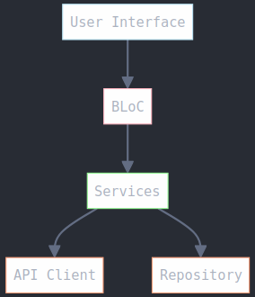

# Artplay: launcher

This is the official repository for the Artplay: launcher - the simple way to launcher our mobile version of SA-MP, built with Dart & Flutter.
***

Latest build status

[](https://codemagic.io/apps/67ae242b16ac4c6e7268ba9d/67ae242b16ac4c6e7268ba9c/latest_build)
***

&nbsp;

## Getting Started

Artplay: launcher is currently at v1.0.x and is built against Flutter 3.16.5+.

#### Building from source

If you do not already have the Flutter SDK installed, follow the instructions from the
Flutter site [here](https://flutter.dev/docs/get-started/install).

Fetch the latest from main:

```
git clone https://github.com/artplaygamesofc/artplay_launcher.git
```

From the artplay_launcher directory fetch the dependencies:

```
flutter packages get
```

Then either run:

```
flutter run
```

Or build:

```
flutter build apk
```

## Built With

Artplay: launcher makes use of several amazing packages available on [pub.dev](https://pub.dev). Below is a
list of the packages that
are heavily used within the application.

* [Flutter](https://flutter.dev/) - SDK.
* [RxDart](https://pub.dev/packages/rxdart) - adds additional capabilities to Dart Streams and
  StreamControllers.

## Architecture



Artplay: launcher takes a layered approach:

* UI - The UI presented to the users.
* BLoC - Handles the state for the UI. Communication between the UI and BLoC is entirely via Sinks
  and Streams.
* Services - Interacts with the API and Repository to provide data handling routines to the BLoCs
  and other services.
* API - Interacts with the servers API.
* Repository - Provides for data management.

## Contributing

If you have an issue or discover a bug, please raise a GitHub issue. Pull requests are also welcome.

## Have a question?

If you wish to reach out to me directly you can find me
at [marlonlorram94@gmail.com](mailto:marlonlorram94@gmail.com).

## License

Artplay: launcher is released under a BSD-Style License. See the LICENSE file for further details.
